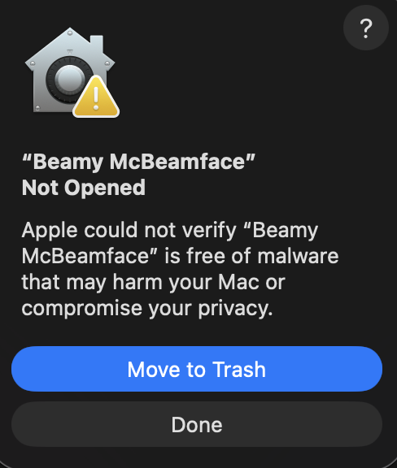

<p align="center">
  
  &nbsp;&nbsp;&nbsp;
  
</p>

<p align="center">
  <strong>The free, open-source video beamer for Mac</strong><br>
  <em>(That's "streamer" for our non-Euro-English friends 😉)</em>
</p>

---

## What is Beamy?

**Beam any video to your Chromecast — for free.**

- 🎬 **Play ANY video format** — MKV, AVI, MP4, MOV, and more
- 📺 **Just drag & drop** — No conversion, no hassle
- 🔄 **Transcodes on-the-fly** — FFmpeg does the heavy lifting
- 🆓 **100% free & open source** — No subscriptions, no ads, no BS

> *Apple TV support coming soon. Maybe. lol*

---

## ⬇️ Download

1. **[Download the latest release](https://github.com/rcoenen/BeamyMcBeamface/releases/latest)**
2. Drag `Beamy McBeamface.app` to your Applications folder
3. Done!

---

## ⚠️ First Launch (macOS 26+)

On first launch, macOS will show this warning — **don't panic, this is normal!**

*(To make this go away, I'd have to pay Apple $99/year for a Developer ID to sign the app. Sorry, not gonna happen!)*

<p align="center">
  
</p>

Since macOS 26 (Tahoe), Apple made Gatekeeper stricter for unsigned apps. The old right-click → Open trick no longer works!

### Here's how to open Beamy:

1. Open **System Settings → Privacy & Security**
2. Scroll **all the way down** to the "Security" section
3. You'll see: *"Beamy McBeamface was blocked..."*
4. Click **Open Anyway** → **Open**

✅ That's it! Beamy is now permanently whitelisted — you won't see this again.

---

## Prerequisites

The only (potentially) tricky bit: you need **FFmpeg** and **ffprobe** installed.

The easiest way is via [Homebrew](https://brew.sh):

```bash
brew install ffmpeg
```

That's it! For a detailed guide, see: [How to Install FFmpeg on Mac](https://phoenixnap.com/kb/ffmpeg-mac)

---

## Usage

1. Launch Beamy McBeamface
2. Select your Chromecast from the dropdown
3. Drag a video file onto the window
4. Enjoy! 🍿

---

## How It Works

```
[ Your Video ] → [ FFmpeg Transcoder ] → [ HTTP Stream ] → [ Chromecast ]
```

Beamy transcodes your video on-the-fly and streams it to your TV. The Chromecast just plays the stream — no special codecs needed on the TV side.

For the nerdy details, see [docs/ARCHITECTURE.md](docs/ARCHITECTURE.md).

---

## Building from Source

See [docs/BUILD_DEBUG.md](docs/BUILD_DEBUG.md).

---

## License

Free & Open Source Software. Do what you want with it!
